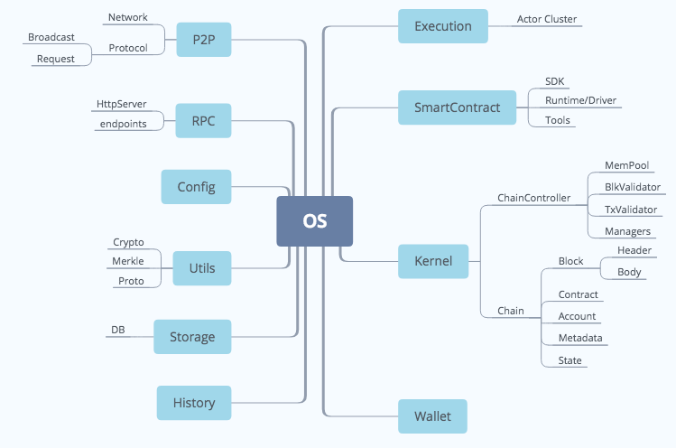

## Findings
1. Stores and managers can be made into generic types
1. Some unused types (IChainBlock)
1. Functionalities can be consolidated into one module
1. Tight coupling in node
1. Definition/use of state is not clear

## Principles
1. Components work are registered like plugins (e.g. autofac injection)
1. Component defines their interaction APIs via method attribute, and the marked endpoints will be registered upon startup in rpc module
   * API component maybe separate from principal component
1. Server functionalities are separate from protocol/api for network/rpc
1. RPC is the main entrypoint for admin
1. SmartContract is the entrypoint for dApp developers
1. Wallet is an optional component
1. Kernel's are composed of chains whose activities are handled by chaincontrollers
1. Interaction between components are defined in a small number of general interfaces
1. Types that are transmitted across components are defined in protobuf
1. Interfaces and and types are packaged according to use scenarios
1. History indexing

## Proposed Components

## Main Components
1. Kernel
   Composed of chain controllers
1. Execution
   Handles execution
1. SmartContract (facing contract developers)
   Mainly SDK and runtime, provides executive for Execution and Kernel

## Other Components
1. P2P
1. RPC
1. Storage
1. Config
1. Utils
1. History
1. Wallet (Optional)

## Interactions
1. Kernel listens to events in P2P for broadcasted Transactions and Blocks
1. Kernel queris Transaction and Blocks from P2P
1. RPC API manages Kernel
1. ChainController sends txn execution requests to Executor
1. Executor loads executives provided by SmartContract
1. RPC API calls the Executor directly
1. General interfaces between chain controller and SC0
   * For create system transactions
   * For querying chain state info to be used in chain controller
   * Delegate block validation/transaction validtion to SC0
     * Block header and consensus protocol is customizable
     * Transaction validation contains chain specific logics and account specific logics (authorization)
1. For indexing
   * Adaptors are like smart contracts except that they will be called differently from chain controller

## Notes
1. Chain controller contains only general interfaces, most logics will be delegated to SC0 (so that it can be customizable)
1. Chain creation requires some information to be registered in the parent chain (so that indexing and other interchain stuff can happen) and a chain controller (with customized SC0) set up for the new chain
1. For non-merge-mining chains, below are the options:
   * An adaptor running side-chain full/light node works as a wrapper, side chain doesn't need to do extra work
   * A merge-mining chain works as a proxy, side chain has to send transaction to the merge-mining chain
